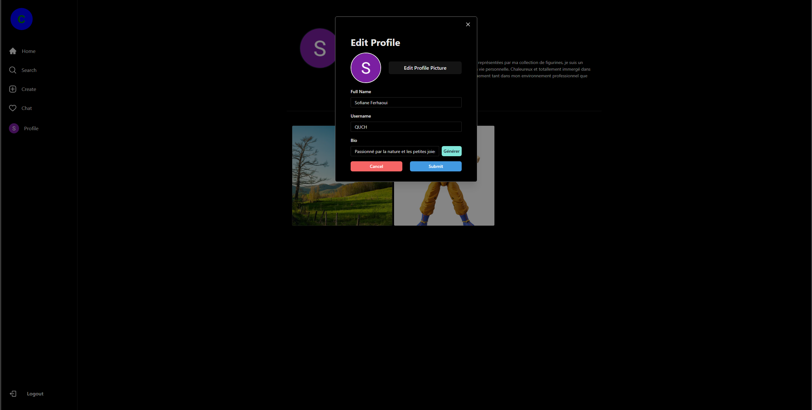
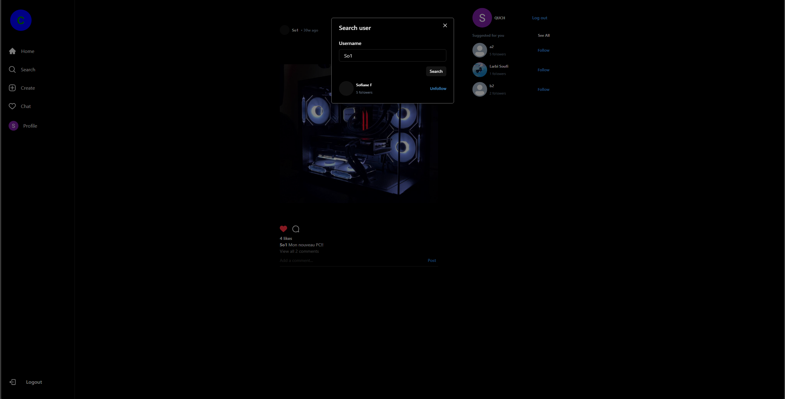
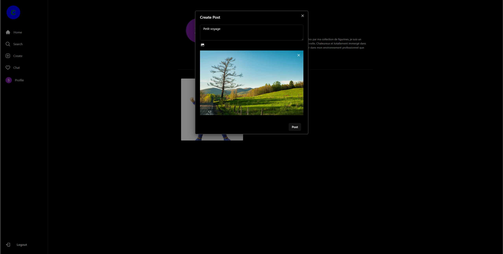
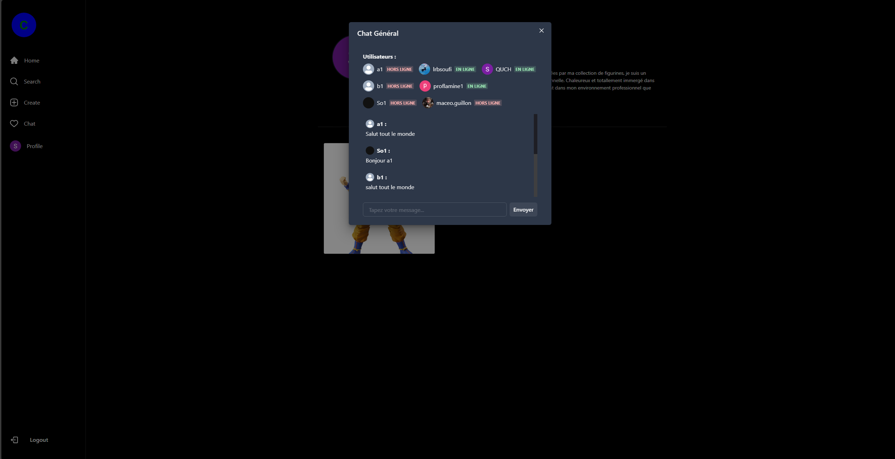
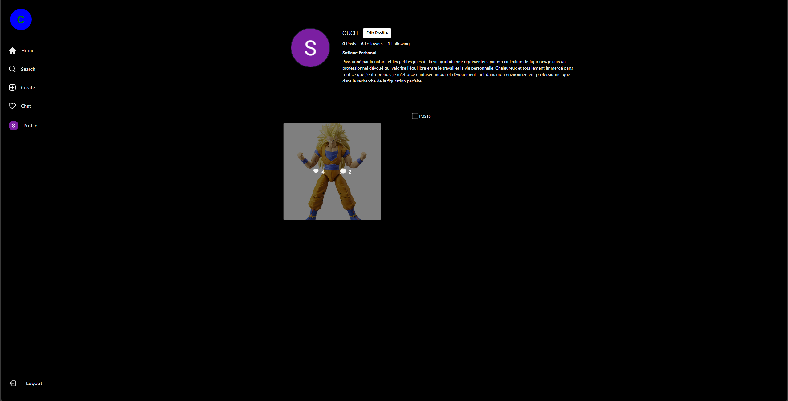
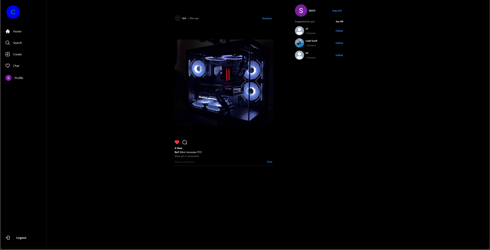

# MyCircle - Réseau Social en React + Firebase

MyCircle est une application de réseau social développée avec React et Firebase. Les utilisateurs peuvent créer des comptes, publier des images, discuter dans un chat général, rechercher d'autres utilisateurs et personnaliser leur profil.

## 🔧 Fonctionnalités principales

- 🔐 Authentification Firebase
- 🏠 Page d'accueil avec posts
- 🔎 Recherche d'utilisateurs
- 📸 Création de posts avec images
- 💬 Chat en temps réel
- 👤 Profil avec biographie et photo de profil
- 🖼️ Générateur automatique de bio (avec OpenAI - désactivé dans cette version publique)

## 📸 Aperçu de l'application

| Modifier le profil | Rechercher un utilisateur | Ajouter un post |
|--------------------|---------------------------|------------------|
|  |  |  |

| Chat général | Profil utilisateur | Accueil |
|--------------|--------------------|---------|
|  |  |  |

## 🧪 Technologies utilisées

- React
- Firebase (Auth, Firestore, Storage)
- Tailwind CSS
- Vite

## 🚀 Lancer le projet localement

```bash
git clone https://github.com/TON_UTILISATEUR/mycircle-social-app.git
cd mycircle-social-app
npm install
npm run dev
